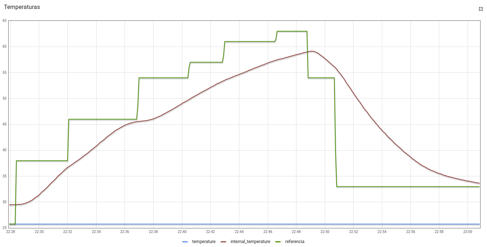
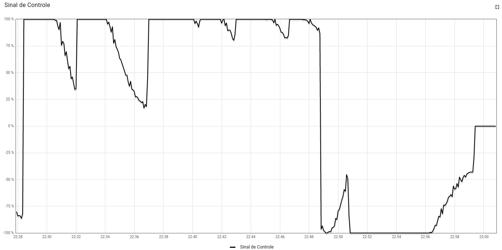
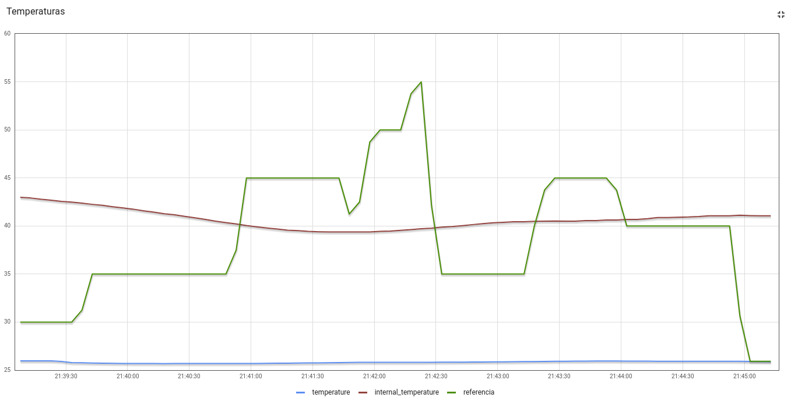
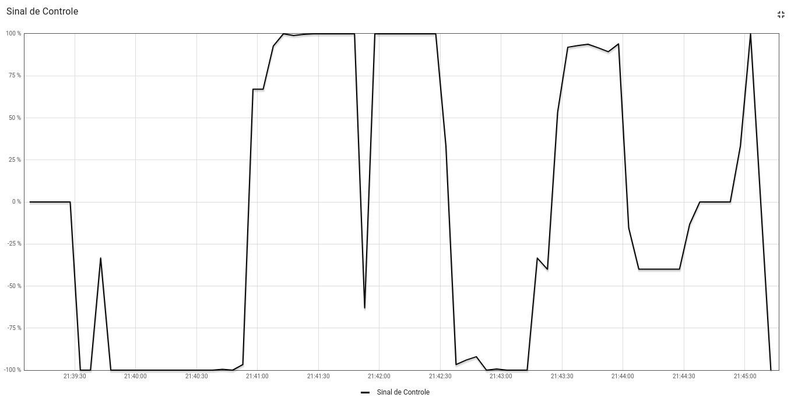

# FSE_TP2

Implementação de um sistema (que simula) o controle de um forno para soldagem de placas de circuito impresso (PCBs). Referente ao [Trabalho 2](https://gitlab.com/fse_fga/trabalhos-2022_2/trabalho-2-2022-2) disciplina de Fundamentos de Sistemas Embarcados (FSE).

## Execução

### Instalação do ambiente

Para instalar o ambiente de desenvolvimento, basta executar o comando abaixo para instalar as dependências necessárias:

```bash
pip install -r requirements.txt
```

### Execução do projeto

Para executar o projeto, basta executar o comando abaixo:

```bash
python src/main.py
```

### Funcionamento do projeto

Após executar o arquivo `main.py`, o programa irá guiar o uso através do terminal.

Para sair do programa, basta pressionar `Ctrl+C`.

### Gráficos das coletas

Foram realizadas coletas para demonstrar o funcionamento do sistema, as coletas se encontram armazenadas
na pasta `static`, contendo:

Nome do arquivo | Modo | Tempo
--|--|--
[curve.csv](statics/curve.csv) | Modo curva | 33 minutos
[fixed.csv](statics/fixed.csv) | Modo Fixo | 5 minutos

#### Gráfico modo curva

#### Temperatura



##### Sinal de controle



#### Gráfico modo Fixo

#### Temperatura



##### Sinal de controle


